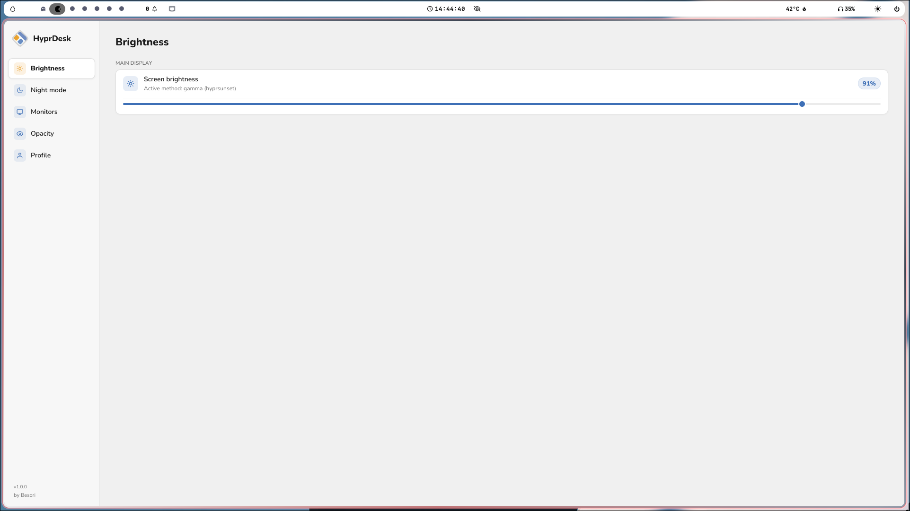
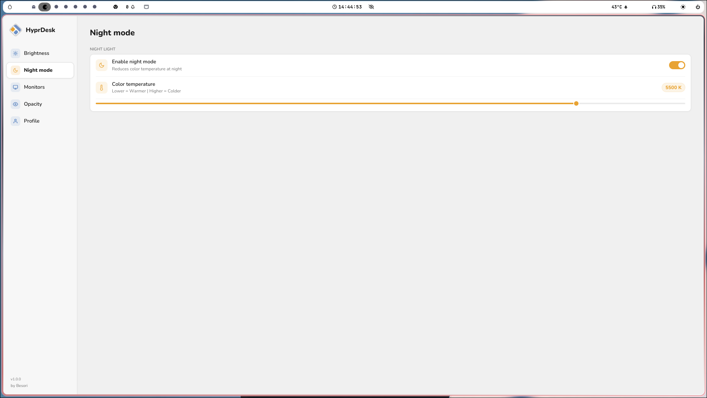
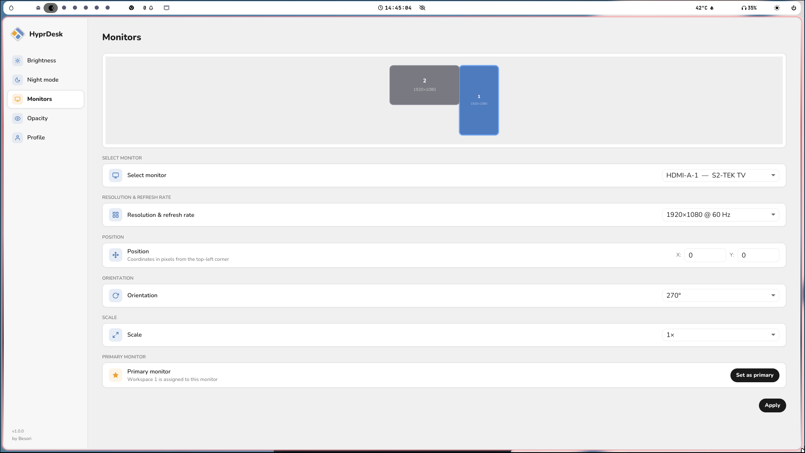
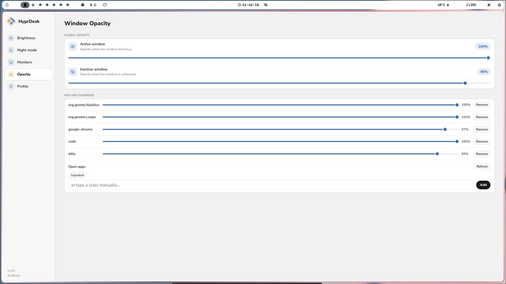
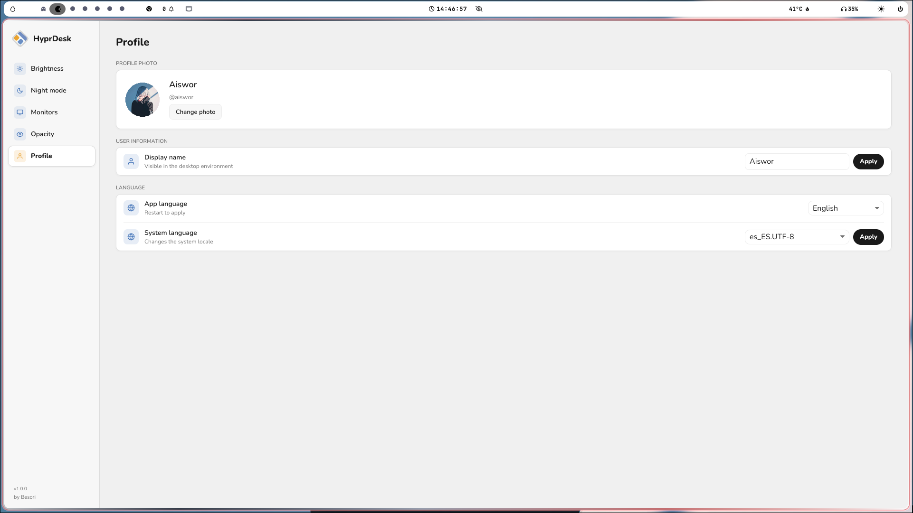

<p align="right"><a href="docs/README.es.md">Español</a></p>

<p align="center">
  
</p>

<p align="center">
  A clean, native settings panel for <a href="https://hyprland.org">Hyprland</a>
</p>

<p align="center">
  
  
  
  
</p>

---

## Features

### Brightness
Control your screen brightness in real time. Automatically detects the best available method (`brightnessctl` or gamma fallback), and can restore the last value on every boot via `exec-once`.

### Night mode
Reduce eye strain at night by lowering the color temperature (1000–6500 K). Supports `hyprsunset`, `wlsunset`, `gammastep` and `redshift`, uses whatever is installed.

### Monitors
Full monitor management from a single panel:
- **Drag-to-arrange** canvas, move monitors visually, positions snap to edges automatically
- Resolution & refresh rate selector
- Position (X / Y), orientation and scale per monitor
- Set any monitor as primary (assigns workspace 1)

### Opacity
Fine-tune window transparency without touching any config file:
- Global opacity for active and inactive windows
- Per-app overrides, pick from open windows or type a class manually

### Profile
Personalise your desktop environment:
- Change your avatar with a built-in crop tool
- Edit your display name
- Switch app language (English / Spanish)
- Change the system locale

---

## Screenshots

### Brightness


### Night mode


### Monitors


### Opacity


### Profile


---

## Installation

### Quick install (all distros)

```bash
curl -fsSL https://raw.githubusercontent.com/Besori-Company/HyprDesk/main/scripts/install.sh | bash
```

Downloads the latest precompiled binary and sets everything up. No Rust required.

---

### Arch / Manjaro (AUR)

```bash
yay -S hyprdesk
# or
paru -S hyprdesk
```

---

### Debian / Ubuntu

```bash
curl -LO https://github.com/Besori-Company/HyprDesk/releases/latest/download/hyprdesk_amd64.deb
sudo dpkg -i hyprdesk_amd64.deb
```

---

### Fedora / RHEL

```bash
sudo dnf install https://github.com/Besori-Company/HyprDesk/releases/latest/download/hyprdesk_x86_64.rpm
```

---

### Build from source

```bash
git clone https://github.com/Besori-Company/HyprDesk.git
cd HyprDesk
./scripts/install.sh
```

Requires a Rust toolchain (`rustup`) and a GPU with Vulkan support.

---

**Required tools** (installed automatically by the installer):
- `brightnessctl`: Hardware backlight control
- `hyprsunset` / `wlsunset` / `gammastep` / `redshift`: Night mode — uses whichever is installed (Arch gets hyprsunset, others get wlsunset if none found)
- `hyprctl`: Monitor and opacity management (included with Hyprland)
- `polkit` (`pkexec`): Privilege escalation for profile settings (display name and locale)
- `glib2` (`gdbus`): AccountsService D-Bus for avatar and display name
- `accountsservice`: System daemon for user account management (avatar and display name)

## Uninstall

```bash
curl -fsSL https://raw.githubusercontent.com/Besori-Company/HyprDesk/main/scripts/uninstall.sh | bash
```

Or if you have the repo cloned: `./scripts/uninstall.sh`

---

## Compatibility

Tested on Fedora Linux 44 with Hyprland 0.55.1. Settings are applied live via `hyprctl` and written directly to your existing Hyprland config files — no new files created unless needed.

---

## License

[MIT + Commons Clause](LICENSE.md)
