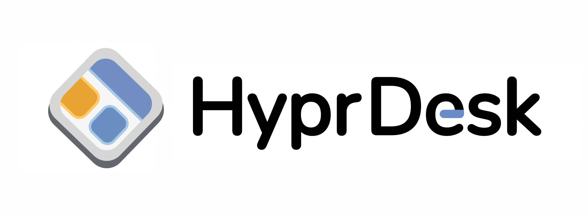
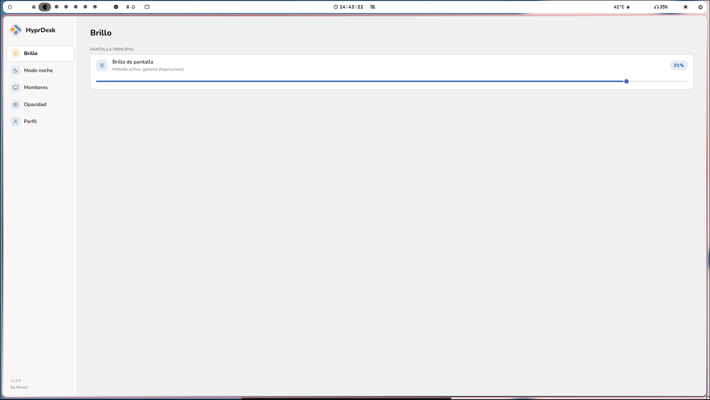
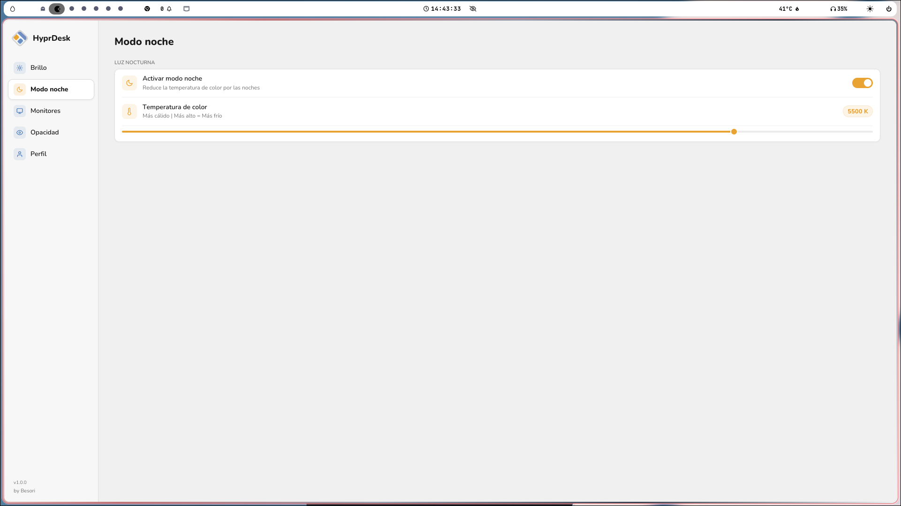
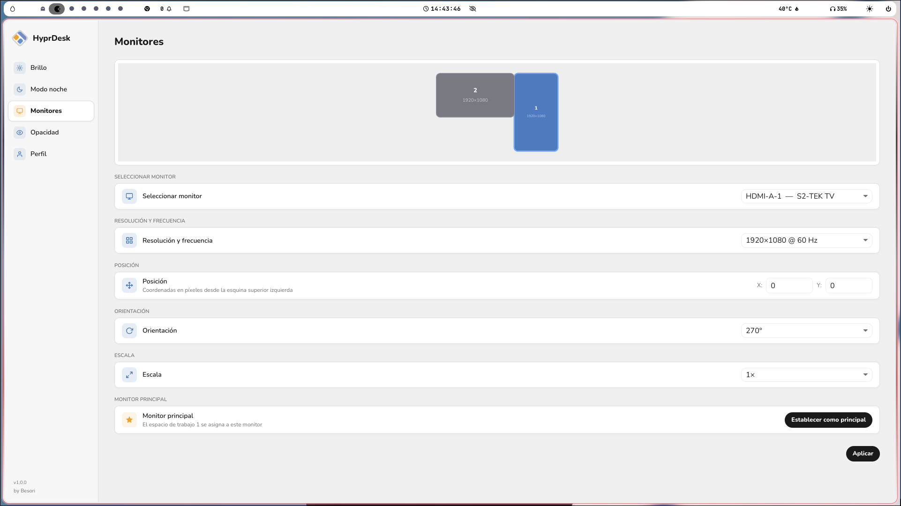
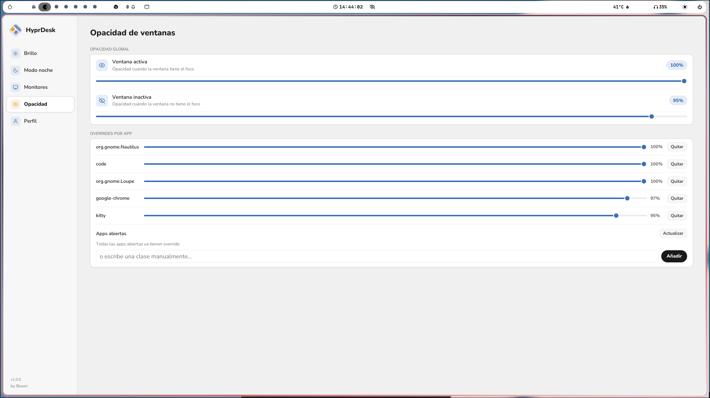
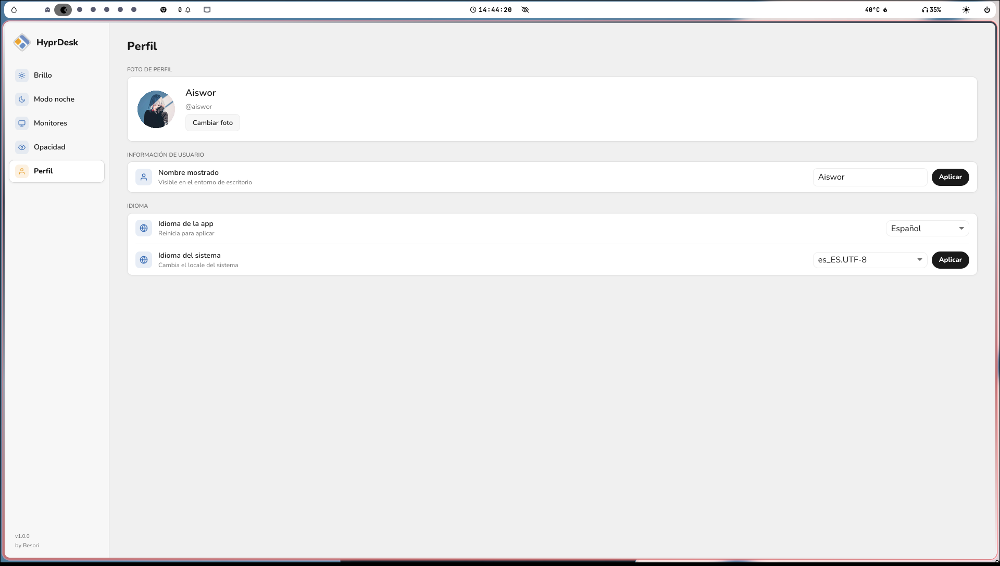

<p align="right"><a href="../README.md">English</a></p>

<p align="center">
  
</p>

<p align="center">
  Panel de configuración nativo y limpio para <a href="https://hyprland.org">Hyprland</a>
</p>

<p align="center">
  
  
  
  
</p>

---

## Funcionalidades

### Brillo
Controla el brillo de tu pantalla en tiempo real. Detecta automáticamente el mejor método disponible (`brightnessctl` o ajuste gamma), y puede restaurar el último valor en cada arranque mediante `exec-once`.

### Modo noche
Reduce la fatiga visual bajando la temperatura de color (1000–6500 K). Compatible con `hyprsunset`, `wlsunset`, `gammastep` y `redshift`, usa lo que tengas instalado.

### Monitores
Gestión completa de monitores desde un único panel:
- **Canvas de arrastre**, mueve los monitores visualmente, las posiciones se pegan a los bordes automáticamente
- Selector de resolución y frecuencia de refresco
- Posición (X / Y), orientación y escala por monitor
- Establece cualquier monitor como principal (asigna el workspace 1)

### Opacidad
Ajusta la transparencia de las ventanas sin tocar ningún archivo de configuración:
- Opacidad global para ventanas activas e inactivas
- Overrides por aplicación, elige entre las apps abiertas o escribe la clase manualmente

### Perfil
Personaliza tu entorno de escritorio:
- Cambia tu foto de perfil con herramienta de recorte integrada
- Edita tu nombre de usuario
- Cambia el idioma de la app (Español / Inglés)
- Cambia el locale del sistema

---

## Capturas

### Brillo


### Modo noche


### Monitores


### Opacidad


### Perfil


---

## Instalación

### Instalación rápida (todas las distros)

```bash
curl -fsSL https://raw.githubusercontent.com/Besori-Company/HyprDesk/main/scripts/install.sh | bash
```

Descarga el último binario precompilado y lo configura todo. No requiere Rust.

---

### Arch / Manjaro (AUR)

```bash
yay -S hyprdesk
# o
paru -S hyprdesk
```

---

### Debian / Ubuntu

```bash
curl -LO https://github.com/Besori-Company/HyprDesk/releases/latest/download/hyprdesk_amd64.deb
sudo dpkg -i hyprdesk_amd64.deb
```

---

### Fedora / RHEL

```bash
sudo dnf install https://github.com/Besori-Company/HyprDesk/releases/latest/download/hyprdesk_x86_64.rpm
```

---

### Compilar desde el código fuente

```bash
git clone https://github.com/Besori-Company/HyprDesk.git
cd HyprDesk
./scripts/install.sh
```

Requiere la cadena de herramientas Rust (`rustup`) y una GPU con soporte Vulkan.

---

**Dependencias** (instaladas automáticamente por el instalador):
- `brightnessctl`: Control de brillo por hardware
- `hyprsunset` / `wlsunset` / `gammastep` / `redshift`: Modo noche — usa lo que esté instalado (Arch instala hyprsunset, el resto wlsunset si no hay ninguno)
- `hyprctl`: Gestión de monitores y opacidad (incluido con Hyprland)
- `polkit` (`pkexec`): Escalado de privilegios para el perfil (nombre de usuario y locale)
- `glib2` (`gdbus`): AccountsService D-Bus para avatar y nombre de usuario
- `accountsservice`: Daemon del sistema para la gestión de cuentas de usuario (avatar y nombre)

## Desinstalación

```bash
curl -fsSL https://raw.githubusercontent.com/Besori-Company/HyprDesk/main/scripts/uninstall.sh | bash
```

O si tienes el repositorio clonado: `./scripts/uninstall.sh`

---

## Compatibilidad

Probado en Fedora Linux 44 con Hyprland 0.55.1. Los ajustes se aplican en vivo mediante `hyprctl` y se escriben directamente en tus archivos de configuración de Hyprland existentes — sin crear archivos nuevos salvo que sea necesario.

---

## Licencia

[MIT + Commons Clause](LICENSE.es.md)
